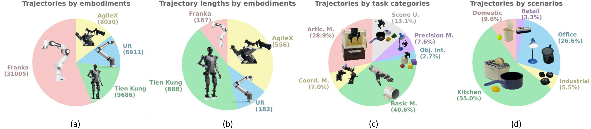
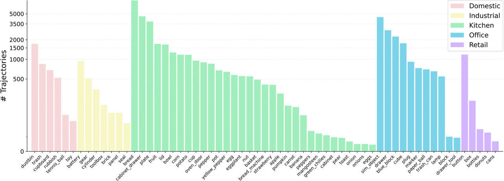

# [RoboMIND: Benchmark on Multi-embodiment Intelligence Normative Data for Robot Manipulation](https://x-humanoid-robomind.github.io/)

[](https://opensource.org/licenses/Apache-2.0)
[](https://x-humanoid-robomind.github.io/)
[](https://arxiv.org/abs/2412.13877)
[](http://open.flopsera.com/flopsera-open/data-details/RoboMIND)


English | [中文](./README.zh.md)
## 💾 Overview of RoboMIND 💾


### 🤖 Composition of RoboMIND 🤖
We present RoboMIND (Multi-embodiment Intelligence Normative Dataset and Benchmark for Robot Manipulation), a comprehensive dataset featuring 55k real-world demonstration trajectories spanning 279 distinct tasks and involving 61 unique object classes.

The RoboMIND dataset integrates teleoperation data from multiple robotic embodiments, comprising 31,005 trajectories from the Franka Emika Panda single-arm robot, 9,686 trajectories from the Tien Kung humanoid robot, 8,030 trajectories from the AgileX Cobot Magic V2.0 dual-arm robot, and 6,911 trajectories from the UR-5e single-arm robot.

RoboMIND provides researchers and developers with an invaluable resource for advancing robotic learning and automation technologies by encompassing a broad spectrum of task types and diverse object categories. This dataset stands out for its substantial scale and exceptional quality, ensuring its effectiveness and reliability in practical applications.

### 🔎 Distribution of Trajectory Lengths 🔎
Different robotic embodiments exhibit distinct trajectory length distributions. Franka and UR robots typically feature shorter trajectories with fewer than 200 timesteps, making them ideal for training fundamental manipulation skills. In contrast, Tien Kung and AgileX robots generally demonstrate longer trajectories exceeding 500 timesteps, which makes them better suited for training long-horizon tasks and complex skill combinations.


### 🚀 Task Categories 🚀
Based on natural language descriptions and considering factors such as object size, usage scenarios, and operational skills, we classify the dataset tasks into five major categories: 1) Articulated Manipulations (Artic. M.).  2) Coordination Manipulations (Coord. M.).  3) Basic Manipulations (Basic M.). 4) Precision Manipulations (Precision M.). 5) Scene Understanding (Scene U.)
Beyond basic manipulations, the dataset includes numerous complex tasks, providing rich data support for training generalized robotic policies.


### 💪 Diversity of Objects 💪
The dataset encompasses 61 distinct object categories. In kitchen scenarios, it includes common foods like strawberries, eggs, bananas, and pears, as well as complex adjustable appliances such as ovens and bread makers. In household settings, the dataset features both rigid objects like tennis balls and deformable objects like toys. Office and industrial scenarios include small objects requiring precise control, such as batteries and gears. This diverse object range enhances dataset complexity and supports training versatile manipulation policies applicable across various environments.





## 📁 Data Description 📁
Building high-quality robotic training datasets is crucial for developing end-to-end embodied AI models with strong generalization capabilities. An ideal dataset should cover diverse scenarios, task types, and robotic embodiments, enabling models to adapt to different environments and reliably execute various tasks. Our team has constructed a large-scale, real-world robotic learning dataset that records interaction data during long-horizon task execution in complex environments, supporting the training of models with general manipulation capabilities.

Below is a partial directory structure example showing two training trajectories and two validation trajectories for a single task using the Franka robot:

```
.
|-- h5_agilex_3rgb
|-- h5_franka_1rgb
|   |-- bread_in_basket
|   |   `-- success_episodes
|   |       |-- train
|   |       |   |-- 1014_144602
|   |       |   |   `-- data
|   |       |   |       `-- trajectory.hdf5
|   |       |   |-- 1014_144755
|   |       |   |   `-- data
|   |       |   |       `-- trajectory.hdf5
|   |       |-- val
|   |       |   |-- 1014_144642
|   |       |   |   `-- data
|   |       |   |       `-- trajectory.hdf5
|   |       |   |-- 1014_151731
|   |       |   |   `-- data
|   |       |   |       `-- trajectory.hdf5
|-- h5_franka_3rgb
|-- h5_simulation
|-- h5_tienkung_gello_1rgb
|-- h5_tienkung_xsens_1rgb
|-- h5_ur_1rgb
```

## 🗃️ HDF5 File Format 🗃️

Please refer to [all_robot_h5_info.md](./static/all_robot_h5_info.md).

Due to equipment maintenance, 675 trajectories in the h5_franka_3rgb folder only contain image data from the left and right cameras. 

For the specific data paths, please refer to [franka_3rgb_2cam_paths.md](./static/franka_3rgb_2cam_paths.md).

## Task Language Instructions

We have provided corresponding language instructions for each task [RoboMIND_instr.csv](./static/RoboMIND_v1_1_instr.csv)。

## 📊 Example of Data Usage 📊

Please refer to [Quick_Start.ipynb](./static/quick_start.ipynb).

We provide a simple Franka sample trajectory along with the code for reading the dataset [read_h5.py](./static/read_h5.py) and [pick_apple_into_drawer_h5.zip](https://drive.google.com/file/d/1EC26fwhftw-9h_HJ5ohqxf4kcEJe_ZzH/view?usp=sharing).


## 📝 Citation 📝
If you find RoboMIND helpful in your research, please consider citing:

```
@article{wu2024robomindbenchmarkmultiembodimentintelligence,
        title={RoboMIND: Benchmark on Multi-embodiment Intelligence Normative Data for Robot Manipulation},
        author={Kun Wu and Chengkai Hou and Jiaming Liu and Zhengping Che and Xiaozhu Ju and Zhuqin Yang and Meng Li and Yinuo Zhao and Zhiyuan Xu and Guang Yang and Zhen Zhao and Guangyu Li and Zhao Jin and Lecheng Wang and Jilei Mao and Xinhua Wang and Shichao Fan and Ning Liu and Pei Ren and Qiang Zhang and Yaoxu Lyu and Mengzhen Liu and Jingyang He and Yulin Luo and Zeyu Gao and Chenxuan Li and Chenyang Gu and Yankai Fu and Di Wu and Xingyu Wang and Sixiang Chen and Zhenyu Wang and Pengju An and Siyuan Qian and Shanghang Zhang and Jian Tang},
        journal={arXiv preprint arXiv:2412.13877},
        year={2024}
      }
```


## 🗨️ Discussions 🗨️
If you're interested in RoboMIND, welcome to join our WeChat group for discussions.


