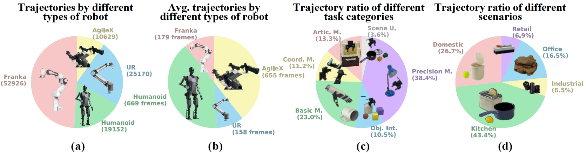
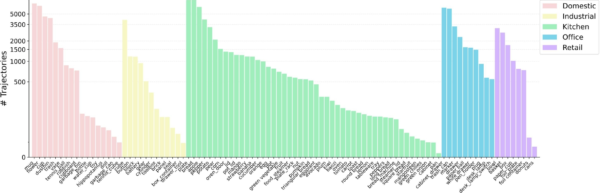

# [RoboMIND: Benchmark on Multi-embodiment Intelligence Normative Data for Robot Manipulation](https://x-humanoid-robomind.github.io/)
Accepted by [Robotics: Science and Systems (RSS) 2025](https://roboticsconference.org/program/papers/152/)

[](https://opensource.org/licenses/Apache-2.0)
[](https://x-humanoid-robomind.github.io/)
[](https://arxiv.org/abs/2412.13877)
[](http://open.flopsera.com/flopsera-open/data-details/RoboMIND)
[](https://huggingface.co/datasets/x-humanoid-robomind/RoboMIND)

English | [中文](./README.zh.md)

## 💾 Overview of RoboMIND 💾


### 🤖 Composition of RoboMIND 🤖
We present RoboMIND (Multi-embodiment Intelligence Normative Dataset and Benchmark for Robot Manipulation), a comprehensive dataset featuring 107k real-world demonstration trajectories spanning 479 distinct tasks and involving 96 unique object classes.

The RoboMIND dataset integrates teleoperation data from multiple robotic embodiments, comprising 52,926 trajectories from the Franka Emika Panda single-arm robot, 19,152 trajectories from the Tien Kung humanoid robot, 10,629 trajectories from the AgileX Cobot Magic V2.0 dual-arm robot, and 25,170 trajectories from the UR-5e single-arm robot.

RoboMIND provides researchers and developers with an invaluable resource for advancing robotic learning and automation technologies by encompassing a broad spectrum of task types and diverse object categories. This dataset stands out for its substantial scale and exceptional quality, ensuring its effectiveness and reliability in practical applications.

### 🔎 Distribution of Trajectory Lengths 🔎
Different robotic embodiments exhibit distinct trajectory length distributions. Franka and UR robots typically feature shorter trajectories with fewer than 200 timesteps, making them ideal for training fundamental manipulation skills. In contrast, Tien Kung and AgileX robots generally demonstrate longer trajectories exceeding 500 timesteps, which makes them better suited for training long-horizon tasks and complex skill combinations.


### 🚀 Task Categories 🚀
Based on natural language descriptions and considering factors such as object size, usage scenarios, and operational skills, we classify the dataset tasks into six major categories: 1) Articulated Manipulations (Artic. M.).  2) Coordination Manipulations (Coord. M.).  3) Basic Manipulations (Basic M.). 4) Multiple Object Interactions (Obj. Int.). 5) Precision Manipulations (Precision M.). 6) Scene Understanding (Scene U.)
Beyond basic manipulations, the dataset includes numerous complex tasks, providing rich data support for training generalized robotic policies.


### 💪 Diversity of Objects 💪
The dataset encompasses 96 distinct object categories. In kitchen scenarios, it includes common foods like strawberries, eggs, bananas, and pears, as well as complex adjustable appliances such as ovens and bread makers. In domestic settings, the dataset features both rigid objects like tennis balls and deformable objects like toys. Office and industrial scenarios include small objects requiring precise control, such as batteries and gears. This diverse object range enhances dataset complexity and supports training versatile manipulation policies applicable across various environments.





## 📁 Data Description 📁
Building high-quality robotic training datasets is crucial for developing end-to-end embodied AI models with strong generalization capabilities. An ideal dataset should cover diverse scenarios, task types, and robotic embodiments, enabling models to adapt to different environments and reliably execute various tasks. Our team has constructed a large-scale, real-world robotic learning dataset that records interaction data during long-horizon task execution in complex environments, supporting the training of models with general manipulation capabilities.

Below is a partial directory structure example showing two training trajectories and two validation trajectories for a single task using the Franka robot:

```
.
|-- h5_agilex_3rgb
|-- h5_franka_1rgb
|   |-- bread_in_basket
|   |   `-- success_episodes
|   |       |-- train
|   |       |   |-- 1014_144602
|   |       |   |   `-- data
|   |       |   |       `-- trajectory.hdf5
|   |       |   |-- 1014_144755
|   |       |   |   `-- data
|   |       |   |       `-- trajectory.hdf5
|   |       |-- val
|   |       |   |-- 1014_144642
|   |       |   |   `-- data
|   |       |   |       `-- trajectory.hdf5
|   |       |   |-- 1014_151731
|   |       |   |   `-- data
|   |       |   |       `-- trajectory.hdf5
|-- h5_franka_3rgb
|-- h5_simulation
|-- h5_tienkung_gello_1rgb
|-- h5_tienkung_xsens_1rgb
|-- h5_ur_1rgb
```

## 🗃️ HDF5 File Format 🗃️

Please refer to [all_robot_h5_info.md](./static/all_robot_h5_info.md).

Due to equipment maintenance, 675 trajectories in the h5_franka_3rgb folder only contain image data from the left and right cameras. 

For the specific data paths, please refer to [franka_3rgb_2cam_paths.md](./static/franka_3rgb_2cam_paths.md).

In the simulation data, the acquisition frequency of the camera and the robotic arm is approximately 1:4. Additionally, the depth image is not available temporarily.

## 🧰 Task Language Instructions 🧰 

We have provided corresponding language instructions for each task [RoboMIND_instr.csv](./static/RoboMIND_v1_2_instr.csv)。

## 📊 Example of Data Usage 📊

Please refer to [Quick_Start.ipynb](./static/quick_start.ipynb).

Please note:

1. For h5_franka_3rgb, h5_franka_1rgb, h5_ur_1rgb, and h5_franka_fr3_dual, the image channel order is BGR.
2. For all other robotic embodiments, the image channel order is RGB.

```python
if sensor_type == 'rgb_images':
    # These embodiments image data are recorded in BGR
    if cur_embodiments in ['h5_franka_3rgb', 'h5_franka_1rgb', 'h5_ur_1rgb', 'h5_franka_fr3_dual']:
        img = cv2.cvtColor(img, cv2.COLOR_BGR2RGB)
    # Other embodiments image data are recorded in RGB  
    else:
        img = img
```

## RoboMIND intrinsics
See this file  [RoboMIND intrinsics](./static/RoboMIND_intrinsics.md).

## 📖 Version Update 📖

### Version 1.1 & 1.2

Compared to Version 1.0, we further expanded the dataset, which now includes 107K trajectories, 479 tasks, and covers 96 different object classes.

In version 1.2, we added 10 tasks of Upright_Cup data to Version 1.1, including 1 real-world task and 9 tasks from the digital twin environment. The goal of these 10 tasks is to flip a mug, but they involve different environmental settings, such as the range of mug placement, table textures, and mug appearances.

The frame-level fine-grained language instruction annotation data has been updated. Please refer to [language_description_annotation_json](./static/language_description_annotation_json)

For more HDF5 file formats, please refer to [all_robot_h5_info_v1.2.md](./static/all_robot_h5_info_v1.2.md).

### Version 1.0

The initial version of RoboMIND contains 55K trajectories, and 279 tasks, and involves 69 different object classes.

## 📝 Citation 📝
If you find RoboMIND helpful in your research, please consider citing:

```
@inproceedings{wu2025robomind,
              title={Robomind: Benchmark on multi-embodiment intelligence normative data for robot manipulation},
              author={Wu, Kun and Hou, Chengkai and Liu, Jiaming and Che, Zhengping and Ju, Xiaozhu and Yang, Zhuqin and Li, Meng and Zhao, Yinuo and Xu, Zhiyuan and Yang, Guang and others},
              booktitle={Robotics: Science and Systems (RSS) 2025}, 
              year={2025},
              publisher={Robotics: Science and Systems Foundation}, 
              url={https://www.roboticsproceedings.org/rss21/p152.pdf} 
}
```
## Reference Document ##
For the input and output when training the model, please refer to [robomind.yaml](./static/robomind.yaml).

## 🗨️ Discussions 🗨️
If you're interested in RoboMIND, welcome to join our WeChat group for discussions.


